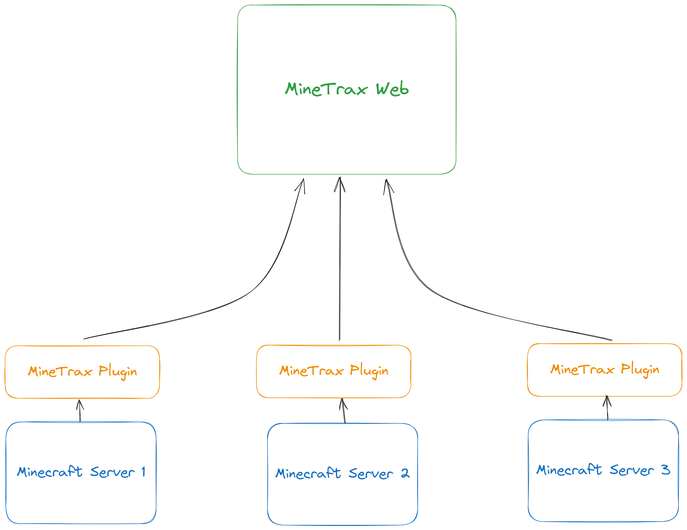

MineTrax has two parts:
 - Web
 - Plugin

You can just install Web if you don't need extra functionalities which Plugin provide.
Though it is highly recommended to install both web and plugin to get the full experience.

## Web
https://github.com/minetrax/minetrax

Developed using Laravel, Web is the main part of suite, i.e, UI and backend layer. It will be hard to host the web in a traditional web hosting, It is recommended to host the web in a virtual(VPS) or dedicated server as per your need. You can always join us on [Discord](https://discord.gg/Hzfj27k) for help or queries.

Web can be installed in one of three ways.
1. [AutoInstaller](../installation/setup-web-autoinstaller.mdx)
2. [Manually](../installation/setup-web-manually.mdx)
3. [Docker](../installation/setup-web-docker.mdx)

### AutoInstaller
Quickest and easiest way to install web is using AutoInstaller (if you have fresh VPS).

AutoInstaller is a script which help you automatically install MineTrax with just one command.
It is a quick way to install MineTrax if you are installing on a fresh VPS/Server (Autoinstaller should only be used in a fresh new VPS).

### Manually
Slowest way to install Minetrax, but give you full control over installation process.

If you installing MineTrax on a existing VPS/Server or you want to follow step and maybe customize few things on the way you might prefer installing it manually.
Use this method only if you are familiar with basic linux commands. 

### Docker
Another quick way to install MineTrax is using Docker.

If you are familiar with Docker or want to run MineTrax in a container, or have an existing VPS with other services running, you may want to use Docker to install MineTrax in those cases.

### AutoInstaller vs Manually vs Docker

Below is a table which will help you decide which method to choose.

| AutoInstaller | Manually | Docker
| -------------- | -------- | -------- |
|   Quick Install  |    Slowest    | Quick Install |
|  Very Easy   |   Moderate, Basic Linux knowledge required    | Easy, Docker knowledge helpful |
|  AutoInstall script require a fresh VPS/Server   |    You can follow manual steps to install in existing VPS/Server     | Can use in both fresh as well as existing VPS/Server |
|  Requires Ubuntu (LTS)   |   You can use different distributions    | Any OS with latest Docker installed |
|  Will Install MySQL & Nginx   |  Can choose between MariaDB/MySQL & Apache/Nginx   | Will Install MySQL & Nginx |
|  Require 2GB Ram & 1 CPU   |  Require 2GB Ram & 1 CPU   | Require 4GB Ram & 2 CPU |

*Both AutoInstaller and Manual Installation do the same thing, AutoInstaller just makes it easier and faster. Docker will run all server in multiple containers using docker compose*

**It is recommended to use AutoInstaller if you are installing on a fresh VPS/Server with Ubuntu (LTS).**

## Plugin
https://github.com/minetrax/plugin

This is the spigot & proxy plugin which you need to install on your Minecraft server. You should install it on all your spigot servers as well as proxy server (Bungee/Velocity) if you have one.
It is responsible for:
 - Calculating and sending Player & Server Intel data to Web.
 - Sending chat and servers log to web if enabled.
 - Enabling users for web to chat with ingame players.
 - Running commands on server from web.
 - Features related to various plugins like SkinsRestorer, Permissions etc.
 - and various other things like whois command /ww etc.

## Flow Diagram
Here is a flow diagram to understand how MineTrax works.
