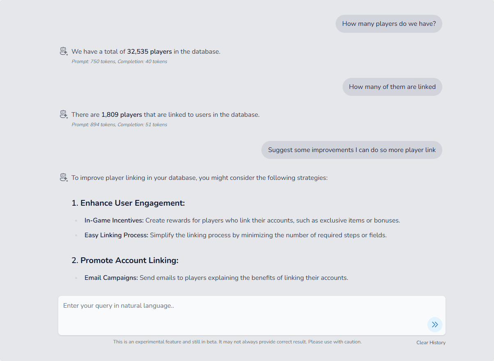

AskDB is a powerful AI base database query system that allows you to ask questions about your server and players. You can ask questions like "How many players joined my server in the last 24 hours?" or "What is the average player rating of my server?" and AskDB will answer them for you.



## How it works?

AskDB uses various LLM (Large Language Model) providers to answer your questions. It uses the data from your server to answer your questions.
Since it uses LLM APIs, you need to have an account on any supported LLM provider and their respective API key to use AskDB.

## Supported LLM Providers

- OpenAI (GPT-3.5, GPT-4)
- Anthropic (Claude)
- Ollama (Local models)
- Mistral
- Groq
- XAI (Xai)
- Google (Gemini)
- DeepSeek

## How to enable AskDB?

AskDB is disabled by default. To enable it, you need to follow these steps:

### 1. Choose and Setup an LLM Provider

By default, AskDB uses OpenAI's GPT-4 Turbo model. You only need to set different environment variables if you want to use a different provider or model.

:::note Model Selection
The models(AI_MODEL) listed below are examples as of March 2024. Each provider frequently releases new and improved models. When setting up AskDB, check your chosen provider's documentation for their latest available models and choose one that best fits your needs in terms of capabilities and cost. The model names and capabilities might have changed since this documentation was written.
:::

#### OpenAI (Default)
1. Go to [OpenAI](https://openai.com/) and create an account (Login if you already have one)
2. Navigate to `API Keys` section in your account settings
3. Create a new API key
4. Use these environment variables:
```env
AI_PROVIDER=openai  # Optional, this is default
OPENAI_API_KEY=sk-...
AI_MODEL=gpt-4o-mini  # Optional, this is default
```

#### Anthropic (Claude)
1. Go to [Anthropic](https://www.anthropic.com/) and create an account
2. Get your API key from the dashboard
3. Use these environment variables:
```env
AI_PROVIDER=anthropic
ANTHROPIC_API_KEY=sk-ant-...
AI_MODEL=claude-3-opus-20240229  # Latest Claude model with similar capabilities
```

#### Ollama (Local Models)
1. [Install Ollama](https://ollama.ai/) on your system
2. Start the Ollama server
3. Use these environment variables:
```env
AI_PROVIDER=ollama
OLLAMA_API_BASE=http://localhost:11434
AI_MODEL=mixtral  # Mixtral 8x7B model recommended for similar capabilities
```

#### Mistral
1. Go to [Mistral AI](https://mistral.ai/) and create an account
2. Get your API key from the platform
3. Use these environment variables:
```env
AI_PROVIDER=mistral
MISTRAL_API_KEY=...
AI_MODEL=mistral-large-latest  # Latest large model
```

#### Groq
1. Sign up at [Groq](https://www.groq.com/)
2. Generate your API key from the dashboard
3. Use these environment variables:
```env
AI_PROVIDER=groq
GROQ_API_KEY=gsk_...
AI_MODEL=mixtral-8x7b-32768  # Mixtral model on Groq's infrastructure
```

#### XAI
1. Get access to XAI's platform
2. Generate your API credentials
3. Use these environment variables:
```env
AI_PROVIDER=xai
XAI_API_KEY=...
AI_MODEL=xai-large  # Their most capable model
```

#### Google (Gemini)
1. Go to [Google AI Studio](https://makersuite.google.com/)
2. Create a project and get your API key
3. Use these environment variables:
```env
AI_PROVIDER=gemini
GEMINI_API_KEY=...
AI_MODEL=gemini-pro  # Their most capable text model
```

#### DeepSeek
1. Visit [DeepSeek](https://deepseek.ai/) and create an account
2. Generate your API key
3. Use these environment variables:
```env
AI_PROVIDER=deepseek
DEEPSEEK_API_KEY=...
AI_MODEL=deepseek-chat-67b  # Their most capable chat model
```

### 2. Enable AskDB

Open .env file of your MineTrax Installation and edit these variables:

```env
AI_ENABLED=true
ASKDB_ENABLED=true
```

Add/Edit the environment variables for the LLM provider you chose in the previous step.
Eg: If you chose OpenAI, add the following variables:
```env
AI_PROVIDER=openai
OPENAI_API_KEY=sk-...
AI_MODEL=gpt-4o-mini  # Optional, this is default
```

### 3. Run update

Run the update script to apply the changes.

```bash
cd /var/www/minetrax
sh update.sh
```

### 4. Done!

Now you can go to AskDB section of your web admin sidebar and start asking questions.

## Permissions

Only staff with `use ask_db` permission can use AskDB. Please be careful while giving this permission to your staff as with this bot they can query anything from your minetrax database.

:::note
Passwords & Secret Keys, be it for the players or the servers, are stored in database in encrypted and hashed form. So you can't query them.
:::
