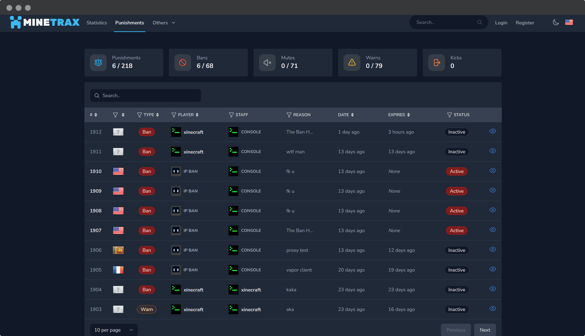

BanWarden feature allows you to keep track of all the punishments (ban, mute, warn, kick) in your servers. It also allows you to manage the punishments and view the details of the punishments.

Key Features:

- View all the punishments in your server.
- View the details of the punishment.
- Manage the punishments (add, remove). (not implemented yet)
- Attach evidence to the punishment.
- AI scoring for the punishment.

## Supported Punishment Plugins

- [LiteBans](https://www.spigotmc.org/resources/litebans.3715/)
- [LibertyBans](https://www.spigotmc.org/resources/libertybans.81063/)
- more coming soon... 

## How to enable BanWarden

Follow the steps below to enable BanWarden:

### Step 1: Enable in plugin settings

Open `config.yml` file in the MineTrax plugin folder and set `banwarden: true` if it is not already set.

```yaml
banwarden: true
```

### Step 2: Enable in Web

In web, BanWarden can be enabled/disabled in two places:

1. Globally in the `.env` file.
2. On a per-server basis in the Server Settings.

#### Step 2.1: Enable in .env file

Open the `.env` file in the root of the project and set `BANWARDEN_ENABLED=true` if it is not already set.

```env
BANWARDEN_ENABLED=true
```

#### Step 2.2: Enable in the Server Settings

1. Go to Admin Panel -> Servers -> Edit Server
2. Check the `BanWarden` checkbox and click on the `Save` button.

### Step 3: (Optional) Sync old punishments

If you have old punishments that you want to sync with BanWarden, you can do so by running the following command in your minecraft server console:

```bash
/minetrax banwarden:sync
```

## Other BanWarden Configurations

### BanWarden AI Score

BanWarden uses AI to score the punishments. You can enable or disable this feature using `BANWARDEN_AI_INSIGHTS_ENABLED` .env variable.

This feature also requires OpenAI API key set.
```php
BANWARDEN_AI_INSIGHTS_ENABLED=true
OPENAI_API_KEY=YOUR_OPENAI_API_KEY
```

### BanWarden Evidence

You can allow your staff to attach evidence to a punishment by giving them the permission `create banwarden_punishments_evidence` & `read create banwarden_punishments_evidence`.

Evidence related configurations can be found in the `.env` file.

## BanWarden .env Configurations

```php
# Global enable/disable BanWarden.
BANWARDEN_ENABLED=true
# Allow public to see punishment reports. If false then only user with permission `read banwarden_punishments` can view.
BANWARDEN_SHOW_PUBLIC=true
# Show masked IP to public.
BANWARDEN_SHOW_MASKED_IP_PUBLIC=false
# Which disk to use for storing punishment related stuff like proofs.
BANWARDEN_MODULE_DISK=private
# Allowed mimetypes for evidence files.
BANWARDEN_EVIDENCE_ALLOWED_MIMETYPES=jpg,png,gif,bmp,webp,mp4,avi,mov,mkv,webm,zip,rar
# Max file size for evidence files in KB.
BANWARDEN_EVIDENCE_MAX_SIZE_KB=51200
# Max count of evidence files per punishment.
BANWARDEN_EVIDENCE_MAX_COUNT=2
# Banwarden AI Insights
BANWARDEN_AI_INSIGHTS_ENABLED=true
# Allow add, delete of punishment from web to staff with permission. (not implemented yet)
BANWARDEN_ALLOW_CONTROL_FROM_WEB=true
```
