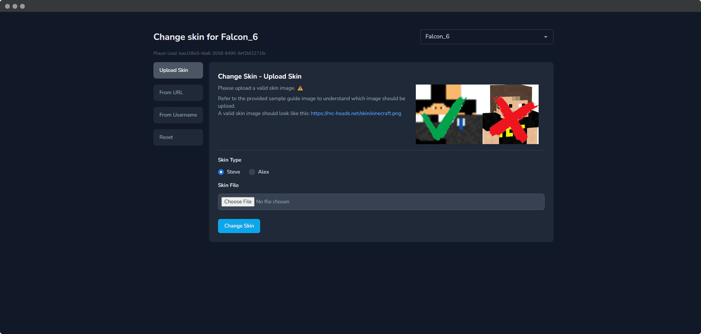

Using this feature, users can change their Minecraft player skin from the MineTrax website. This feature requires SkinsRestorer plugin to be installed on your Minecraft server.



## Enable Skin Change Feature

This feature is enabled by default. You can change as per your need by setting the `PLAYER_SKIN_CHANGER_ENABLED` environment variable to `true` or `false` in the `.env` file.

```bash title=".env"
PLAYER_SKIN_CHANGER_ENABLED=true

# Cooldown in seconds for changing skin. Default to 60 seconds. (won't apply to staff members)
PLAYER_SKIN_CHANGER_COOLDOWN_IN_SECONDS=60
```

Set it to `false` to globally disable this feature for all servers.

## Per Server Configuration

MineTrax let you configure the skin change feature for each server individually. While creating or editing a server, you can enable or disable the skin change feature for that server.


When player changes their skin from the website, it will be trigger on all the servers where the skin change feature is enabled.

## Permissions

- `change any_player_skin` - Give this permission to the staff role to allow them to change any player's skin.
