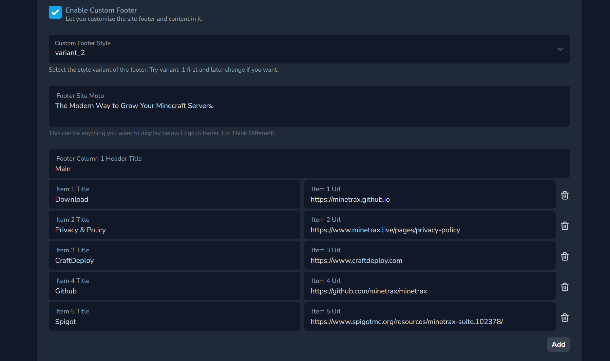

This feature allows you to add custom footer in your web. There are two variants of footer which you can choose from.
1. Footer variant 1

2. Footer variant 2

## How to add custom footer?

1. Go to __Admin Panel__ > __Settings__ > __Navigation Setting__. and scroll down and __Enable Custom Footer__.

