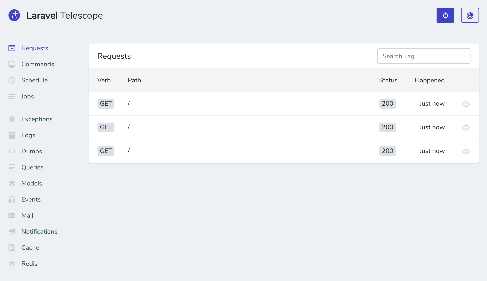
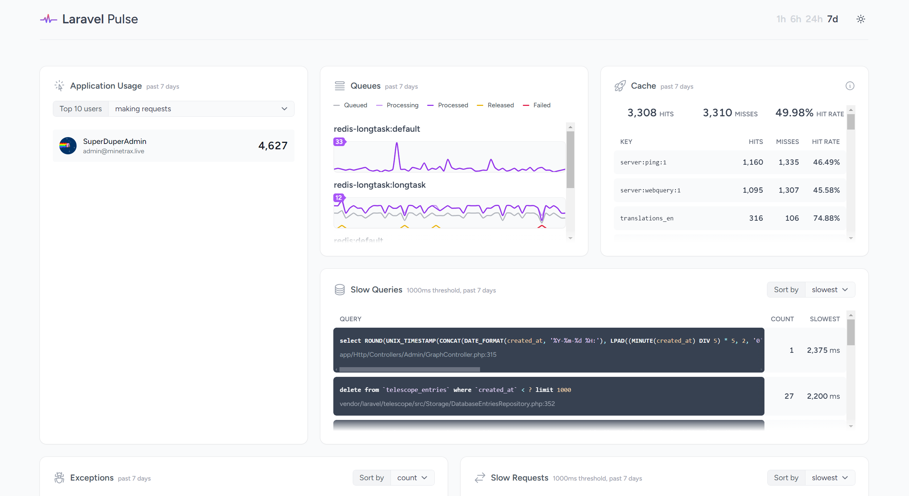

This page provide some tips to debug when you encounter some problems.

## Enable Debug Mode

Debug mode can provide more information about errors. 

To enable debug mode, set `APP_DEBUG` to `true` in `.env` file.

```bash
APP_DEBUG=true
```
Then clear the config cache by running the following command:

```bash
cd /var/www/minetrax
sh update.sh
```

Once you have enabled debug mode, visit the page that has the error again. You should see a detailed error message.

:::danger Disable Debug Mode
After you have fixed the error, remember to disable debug mode by setting `APP_DEBUG` to `false` in `.env` file and clear the config cache again with `sh update.sh`.
:::

## Laravel Telescope

Laravel Telescope is an elegant debug assistant for the Laravel framework. Telescope provides insight into the requests coming into your application, exceptions, log entries, database queries, queued jobs, mail, notifications, cache operations, scheduled tasks, variable dumps and more. Telescope makes a wonderful companion to your local Laravel development environment.



By default, Telescope is disabled. To enable it, set `TELESCOPE_ENABLED` to `true` in `.env` file.

```bash
TELESCOPE_ENABLED=true
```

Then clear the config cache by running the following command:

```bash
cd /var/www/minetrax
sh update.sh
```

After that, you can access Telescope at `https://YOUR_DOMAIN/telescope`. Only superadmin role can access Telescope in production environment. 

:::danger Important
Make sure your `APP_ENV` is NOT set to `local` in `.env` file. Otherwise, Telescope can be accessed by anyone. Always keep `APP_ENV` to `production`.

Telescope exposes sensitive information about your application, such as database queries, exceptions, and more. Make sure you only give access to Telescope to trusted individuals.
:::


## Laravel Pulse

Laravel Pulse is a real-time application performance monitoring tool and dashboard for your Laravel application.
It helps you various metrics about your application and help you to identify performance bottlenecks like slow database queries, slow API calls, jobs that take too long to run, and more.



Pulse can be accessed at `https://YOUR_DOMAIN/admin/pulse`.

By default, Pulse is enabled & accessible by superadmin role only. To disable it, set `PULSE_ENABLED` to `false` in `.env` file.

```bash
PULSE_ENABLED=false
```

Then clear the config cache by running the following command:

```bash
cd /var/www/minetrax
sh update.sh
```