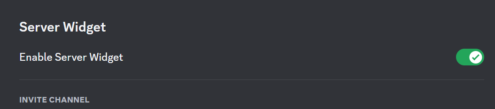
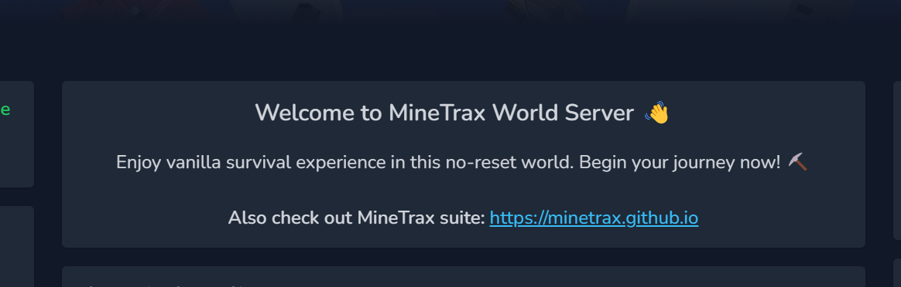
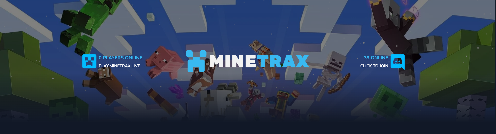

## General Settings

This section contains various settings that are used throughout the site.

### 1. Site Header Logo Image
The logo image that appears in the header of the site. You have to upload for both light and dark mode.

### 2. Site Name
The name of the site. This is used whenever the site name is needed. For example, in footer & while sending emails.

### 3. Online Players List Box
Whether to show the online player list box which appear in top left of home page.

### 4. Online Players Count Box
Whether to show the online player count box which appear in top right of home page.

### 5. In-Game Chat
Whether to show the in-game chat box in home page. Using in-game chat, users can chat with in-game players and vice-versa.

### 6. Shout Box
Whether to show the shout box in home page. Shoutbox is a chat box where users can send messages for everyone to see.

### 7. Newest User Box
Whether to show the newest user box in home page. This box shows the newest user who has registered on the site.

### 8. DidYouKnow Box
Whether to show the did you know box in home page. This box shows a random fact about the game.

### 9. Top Players Box
Whether to show the top players box in home page. This box shows the top players of the game.

### 10. Socials Box
Whether to show the socials box in home page. This box shows icon links of your social media accounts.

### 11. Discord Invite Link
The invite link of your discord server. This is used in places like in header discord button etc.

### 12. Discord Box
Whether to show the discord box in home page. This box shows the discord server widget.

This requires you to enable the discord widget in your discord server settings. You can find the widget settings in your discord server settings under `Server Settings > Widget > Enable Server Widget`.



### 13. Donation Box
Whether to show the donation box in home page. This box shows the donation link and donation goal.

This will require you to provide the `Donation URL`.

### 14. Vote for Server Box
Whether to show the vote for server box in home page. This box shows list of voting sites.

### 15. Enable Status Feed
Whether to enable post feed feature. If disabled, the post feed will be disabled and users will not be able to post status updates.

### 16. Welcome Box
Whether to show the welcome box in home page. This box can be used to show welcome message or any other important message, etc.



This box supports github flavored markdown. You can use markdown to format your message.

### 17. Broadcast Message
This feature allows you to show a moving text with link at top of your site in every page. This can be used to show important messages like server maintenance, updates, events, announcements, etc.

1. Broadcast Text: The text to show in broadcast message. This is required.
2. Broadcast URL: The URL to redirect to when the broadcast message is clicked. This is optional.

*Leave empty to disable this feature.*

## Theme Settings

### 1. Default Color Mode
The default color mode of the site. This is used when the user has not selected any color mode. Can be either `light` or `dark`.

### 2. Hero Section at Homepage
Whether to show the hero section in home page. Hero section is the section that appears at top of the home page.




Various settings related to the hero section are:

#### Hero Foreground Image
The foreground image of the hero section. Appear in the middle middle. It is recommended to use a transparent png image here. Both light and dark mode foreground images can be set.

#### Hero Background Image
The background image of the hero section. Appear in the background. Both light and dark mode background images can be set.

#### Hero Background Size
The size of the background image. Its css property `background-size`. Can be one of the following:
1. `cover`: The background image will cover the entire hero section.
2. `contain`: The background image will be contained in the hero section.
3. `auto`: The background image will be auto sized.
4. `fill`: The background image will fill the hero section.
5. `none`: The background size css property will not be set.

#### Hero Background Position
The position of the background image. Its css property `background-position`. It can be any valid css background position value. For example, `center center`, `left top`, `right bottom`, etc. Try changing this value to see how it affects the background image and choose the one that looks best.

#### Hero Background Repeat
The repeat of the background image. Its css property `background-repeat`. Can be one of the following:
1. `repeat`: The background image will be repeated.
2. `repeat-x`: The background image will be repeated horizontally.
3. `repeat-y`: The background image will be repeated vertically.
4. `no-repeat`: The background image will not be repeated.
5. `space`: The background image will be repeated with space.
6. `round`: The background image will be repeated with round.

#### Hero Background Attachment
The attachment of the background image. Its css property `background-attachment`. Can be one of the following:
1. `scroll`: The background image will scroll with the page.
2. `fixed`: The background image will be fixed.
3. `local`: The background image will be scrolled with the element.

#### Hero Background Height
The height of the hero section. Its css property `height`. Can be any valid css height value. For example, `100px`, `50%`, `auto`, etc. Try changing this value to see how it affects the hero section and choose the one that looks best.

#### Show Join Box in Hero Section
If enabled, will show server join details like player count & join hostname in hero section. (left side)

#### Show Foreground Image Box in Hero Section
If enabled, will show middle foreground image box in hero section (middle).

#### Show Discord Box in Hero Section
If enabled, will show discord box in hero section (right side). Make sure to add Discord Invite URL & Discord Server ID in General Settings.

#### Particle Effect Options
This contain tsParticles JSON options. Check [tsParticles documentation](https://particles.js.org/docs/) for more information.

JSON options example:
```
{
  "autoPlay": true,
  "backgroundMask": {
    "composite": "destination-out",
    "cover": {
      "color": {
        "value": "#fff"
      },
      "opacity": 1
    },
    "enable": false
  },
  ... 
}
```

Check out some sample particle effect options or custom effect in [Hero Particle Effects](./hero-particle-effects) page.

### 3. Animated Loading Image
You can set custom animated loading image for loader that appears when the site load for the first time. You can use a gif or svg image here. 

## Plugin Settings

### 1. Enable Plugin
Whether to enable the plugin. If disabled, plugin will not work as web will refuse to talk to the plugin.

### 2. API Key & API Secret
The API key and API secret of the plugin. This is used to authenticate the plugin with the web. You will need these values when configuring the plugin. 

:::danger Important
Do not share these values with anyone. Reset the API key and API secret using `Reset API Credentials` button if you think they are compromised.
:::

### 3. Enable Account Link
Whether to enable account link feature. If enabled, users will be able to link their in-game account with their web account.

### 4. Max Player Per Account
The maximum number of players that can be linked to a single web account. Default is 1.

### 5. Account Link Success Command
List of commands which should be executed when account link is successful. You can use this to give rewards to the player for linking their account. \{PLAYER_USERNAME\} will be replaced with the player name & \{PLAYER_UUID\} will be replaced with the player UUID.

Eg:
```
give {PLAYER_USERNAME} diamond 1
```

### 5. Account UnLink Success Command

List of commands which should be executed when user unlink a player from his account. Its similar to Account Link Success Command. \{PLAYER_USERNAME\} will be replaced with the player name & \{PLAYER_UUID\} will be replaced with the player UUID.


### 6. Enable Player Rank Sync
Using this feature, Rank in website will be synced with rank in server instead of web calculated rank. This will require you to create a rank for each group you have in server making sure rank shortname matches the name of your player group in server. Eg: If you have a group named `VIP` in server, you will have to create a rank with shortname `VIP` in web.

Currently rank sync can be done only from one server. You will have to choose which server you want to sync rank with.

## Player Settings
This section contains various settings related to players and their rank & ratings.

### 1. Last Activity Day for Rating
Number of days past today for player last seen to be count as active. Non active players will not be included in rating. Default is 30 days (1 month). Set to -1 to disable this.

### 3. Enable Custom Player Rating Algorithm
Whether to enable custom player rating algorithm. If enabled, you will be able to set custom rating algorithm for players rating calculation.

Eg of custom rating algorithm:
```
($total_mob_kills + $total_player_kills + $pvp_damage_given + 
 log10($total_crafted + 1) + log1p($total_items_enchanted) + 
 ($distance_traveled * 0.1) + 
 ($total_fish_caught * 2) - ($total_deaths * 2) + 
 sqrt(abs($total_money))) / 1000
```

There are various variables & functions available for use in custom rating algorithm. You can check those in that page.

### 4. Enable Custom Player Score Algorithm
Whether to enable custom player score algorithm. If enabled, you will be able to set custom score algorithm for players score calculation.

Eg of custom score algorithm:
```
($total_mob_kills + $total_player_kills + $pvp_damage_given + 
 log10($total_crafted + 1) + log1p($total_items_enchanted) + 
 ($distance_traveled * 0.1) + 
 ($total_fish_caught * 2) - ($total_deaths * 2) + 
 sqrt(abs($total_money)))
 ```

There are various variables & functions available for use in custom score algorithm. You can check those in that page.

:::note Why there are two variables - Rating & Score?
Idea of having separate rating & score is to have some varity in ranking players. Score is something we consider to be always increasing as player continue to play in your server with time, while Rating is something that can go up or down depending on player performance kind of like ELO rating system. 

In MineTrax by default we use score to calculate player rank, while we use rating to calculate player position in leaderboards.

This system give new players with better skill a chance to be in leaderboard position sooner, while satisfying long time players to always have higher rank.
:::

### 5. Show Player Intel To
Who can see player intel. Can be one of the following:
1. `Public`: Everyone can see player intel of any player.
2. `Any Authenticated User`: Authenticated users can see player intel of any player.
3. `Linked Account and above`: User who linked player can view player intel for their linked players. Superadmin & Staff role can view all players.
4. `Staff Role and above`: Any staff role & superadmin will be able to view player intel for any player.
5. `Only Superadmin`: Only superadmin will be able to view player intel for any player.

:::info Critical Player Intel Data
Player intel section contain some critical information like player IP address, Ping, Version, etc which will not be shown to anyone except superadmin regardless of this setting. If you want those critical information to be shown to any staff role, you can give `view player_intel_critical` permission to that role.
:::


## Navigation Settings

### 1. Sticky Navigation Menu
Whether to make the navigation menu sticky. If enabled, the navigation menu will stick to top of the page when the user scrolls down.

### 2. Enable Custom Navigation Bar
Whether to enable custom navigation bar. If enabled, you will be able to customize the navigation bar.
Check [Custom NavBar](./custom-navbar) page for more information.

### 3. Enable Custom Footer
Whether to enable custom footer. If enabled, you will be able to customize the footer.
Check [Custom Footer](./custom-footer) page for more information.

## SEO Settings

### 1. Favicon Image
The favicon image of the site. This is the icon that appears in the browser tab.

### 2. Title Main
The main title of the site. This is the title of homepage.
Example: 
```
MineTrax World - Play, Build, Survive, Explore
```

### 3. Title Suffix
The title suffix of the site. This is the suffix that get appended after title for all pages.
Example: 
```
| MineTrax.live
```

For give above example, the final title will look like this:
1. MineTrax World - Play, Build, Survive, Explore - MineTrax World | MineTrax.live
2. Leaderboards | MineTrax.live
3. SEO Settings | MineTrax.live

### 4. Meta Tags
You can add meta tags here. This can be used to add meta tags like description, keywords, etc.

### 5. Code Injections (Inject at Head)
Any code you want to inject in head section of the site. This can be used to add meta tags, css, etc.

### 6. Code Injections (Inject at Body Start)
Any code you want to inject at start of body section of the site. This can be used to add analytics, etc.

### 7. Code Injections (Inject at Body End)
Any code you want to inject at end of body section of the site. This can be used to add chatbot, widgets, etc.

:::danger Be careful with Code Injections
1. Code Injection allows you to inject custom HTML/JS/CSS code into all pages of your website. 
1. This can be very powerful tool for things like adding Widgets etc. 
1. This can also be very dangerous if you don't know what you are doing.
1. Be sure to validate your code before adding here to prevent breaking the site. Invalid code can lead to site malfunction and you may have to reset SEO settings by running command to fix your site.

```bash
cd /var/www/minetrax
php artisan settings:seo:reset
```
:::

## Dangerzone Settings
This section is only visible to superadmin.

### 1. Delete all Shouts
This will delete all shouts from the database.

### 2. Delete all Console Logs
This will delete all console logs from all servers from the database.

### 3. Delete all Chat History
This will delete all chat history from all servers from the database.

### 4. Delete Player Intel
This will delete all player intel related data from the database.

### 5. Delete Server Intel
This will delete all server intel related data from the database.